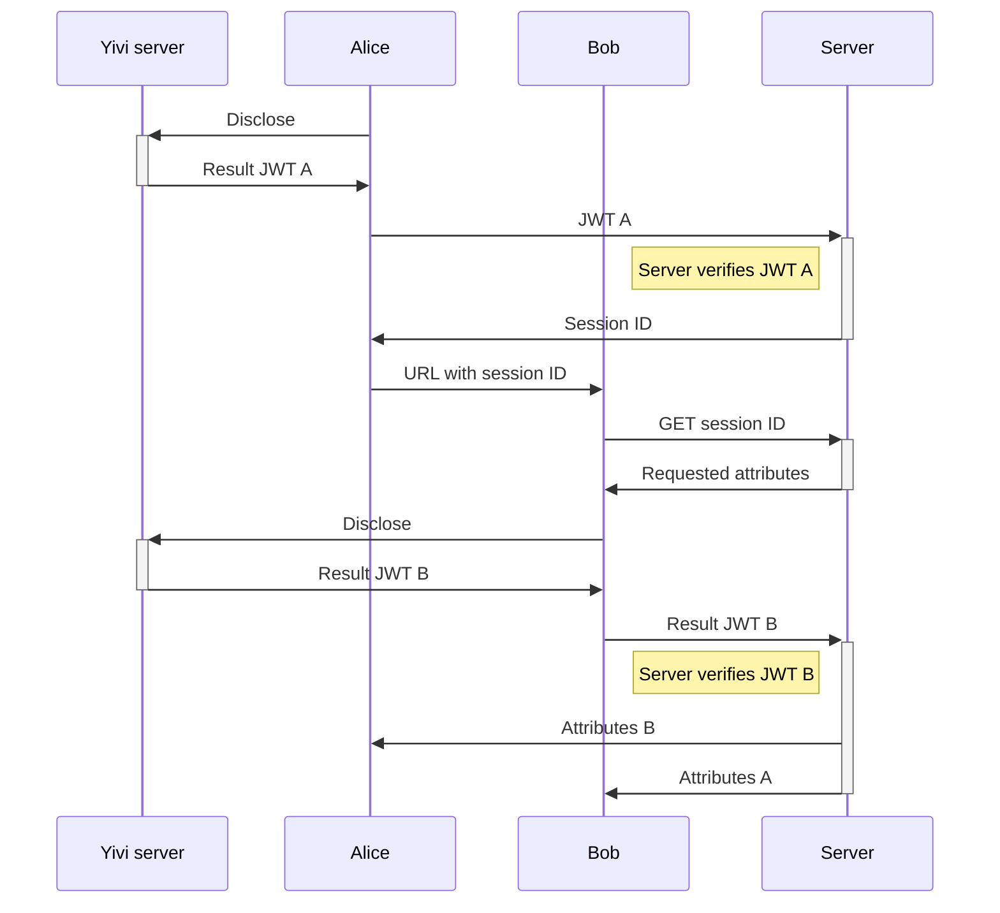

# Do It Yivi

Do It Yivi (DIYivi) is a tool that allows users to easily disclose [Yivi](https://www.yivi.app/) attributes to each other.

## Desired properties

The first goal of DIYivi is for users to be able to disclose Yivi attributes to each other in a privacy-friendly and easy way.

We assume that Alice and Bob are the participants in the exchange, and they have set up a (trusted) channel between them (e.g. through a secure messaging app or email, although the latter of course cannot simply be considered trustworthy).

However, usability is important, so we require that an exchange requires only a single, one-way communication from Alice to Bob over this channel. Additionally, we require that both participants have to do only a single Yivi disclosure (or signature) session.

Some features that we would like are:

1. Zero-knowledgeness, where after the exchange between Alice and Bob, e.g. Bob cannot impersonate Alice to Charlie.
2. Escrow ('gelijk oversteken'), where Alice and Bob only see each other's attributes if both have disclosed them. Neither can cheat to see the other's attributes without disclosing their own.
3. The server should not be able to convince Alice that anyone other than Bob is Bob.
4. Privacy against the server: ideally the server should not know who is disclosing what to whom.

It does not seem possible to achieve all of these features at the same time without changes to Yivi (given the bounds of requiring only one-way communication and one Yivi session per participant). So we need to make some trade-offs.

### Escrow (2), and privacy from the server (4)

Assuming that we require escrow, we need some third party that verifies the disclosures of Alice and Bob, before revealing the attributes.
With Yivi, it is simply not possible for a party to verify a disclosure without seeing the attributes, so escrow requires that the server sees the attributes of both Alice and Bob. Of course, decentralized options may be possible that do not require a single server to see all attributes, but this would be very complex, and offers security only under the assumption that the servers do not collude.

Additionally, it needs to be noted that in any case, the Yivi server involved in any Yivi session will always see the attributes of at least one of the parties. 

### Zero-knowledgeness (1), and server that can't cheat (3)

Zero-knowledgeness is a crucial property, as without it, parties can simply cheat, so the system is not trustworthy.
To have zero-knowledgeness, a solution where Alice and Bob obtain each other's disclosure JWTs is not possible, as then Alice can impersonate Bob to Charlie by replaying this disclosure JWT. So, we need one of the following:

- A solution where the server verifies the disclosures of Alice and Bob, and sends the results (but not the signed JWT that could be replayed) to both parties. This allows the server to cheat and see the attributes (violating properties 3 and 4), but it does allow for escrow (property 2).
- A solution based on attribute-based signatures, such that the signatures can be verified but not replayed.
  This requires that Alice and Bob include a nonce in their signatures, and that, somehow, they know which nonce to expect from the other party. This is not trivial:
  - If the nonces are picked by the initiating party (Alice), then the Alice might be able to pick a nonce that was already used by another party earlier, allowing Alice to replay the other party's signature to Bob. Bob cannot replay a message to Alice.
  - If the nonces are picked by the receiving party (Bob), then Bob might be able to pick a nonce that was already used by another party earlier, allowing Bob to replay the other party's signature to Alice. Alice cannot replay a message to Bob. This also requires Alice to wait for Bob to respond, before she can do her own disclosure, so it limits usability significantly.
  - Doing an exchange between the parties to agree on a nonce might be possible. However, this also requires that both parties are online at the same time. 
  - If the nonce is decided by the server, the server could collude in order to replay, but not fully cheat. This requires some trust in the server, but in that case, it provides zero-knowledgeness. It can also offer either escrow (the server gets to see the signatures) or privacy from the server (the server does not get to see the signatures/attributes, but hence cannot do escrow).
  
  From the schemes based on attribute-based signatures, the latter seems most promising. However, some general issues with attribute-based signatures need to be kept in mind: usability of creating a signature on a nonce is not ideal. At best, the users would see something like: "I disclose my attributes for DIYivi session 1234567890". Additionally, while it's possible to hide the attributes from the *DIYivi* server, the *Yivi* server always still sees the attributes and the message to be signed.

### Making a choice

In the end, it seems that we have to make a choice between a few rough options:

1. Requiring complete trust in the server, allowing for escrow. We can achieve properties 1 and 2, but not 3 and 4.
2. Requiring less trust in the server, less usability due to the use of Yivi *signatures* instead of *disclosures*, with escrow. We can achieve properties 1, 2, and 3 (to some extent), at a cost of usability.
3. Requiring the least trust in the server, but less usability and no escrow. We can achieve properties 1, 3 and 4, but not 2.

All of these options share the limitation that whichever Yivi server is involved in the disclosure or signature sessions will always see the attributes of the parties. This means that, if we make a design that is theoretically privacy-preserving against the *DIYivi* server, this is hardly relevant if the Yivi server is hosted by the same party as the *DIYivi* server. Similarly, the involved *Yivi* server (either in the disclosure sessions or the signature *verification* sessions) are always in a position to cheat (although *signature verification* can theoretically be implemented directly in the users' clients).

There are also further limitations to privacy such as possible linkability of participants based on timing, IP addresses, or browser fingerprints, which we have not yet even considered.

Considering the above, it seems that the best option for DIYivi would be to focus on usability, and require trust in the server.
This is not an unreasonable assumption, for several reasons:
- The Yivi infrastructure already needs to be trusted. As DIYivi is being built for the founders of Yivi, it is reasonable to assume that a production version of DIYivi could be hosted by the same party as Yivi itself.
- The frontend of DIYivi will simply be a webapp. This means that, unless users actually inspect the source code, they will trust the server anyway. Even in a protocol where the server cannot cheat, a very simple attack would be for the server to provide a backdoored frontend.
- The involved *Yivi* server(s) are always in a position to cheat (unless signature verification is implemented directly in the client) and eavesdrop. It is *possible* to implement a system where decentralized Yivi servers are used such that they are not hosted by the same organization that hosts the DIYivi server, but this is not *realistic* for the purpose and scope of DIYivi.

By opting for an approach that trusts the DIYivi backend server, we get significant usability benefits, and it becomes straightforward to implement features like escrow. Some other features that could be added are:

- Expanding to more than two participants:
    - The case where Alice, Bob and Charlie want a three-way exchange (with escrow).
    - The case where Alice wants multiple two-way exchanges for the same attribute set, without Alice having to do a disclosure for each participant.
- The option to enable or disable escrow: the initiator (Alice) can choose whether Bob can see Alice's attributes already before disclosing his own.
- We may require that the exchange of attributes is symmetric (both parties disclose for the same ConDisCon).
    - Optionally, the ConDisCon could have optional parts, and the server can arrange that both parties only see the intersection of the parts that they disclosed. 

      For example, consider if there are attributes A and B, where A is mandatory and B is optional. Alice discloses A and B, but Bob only discloses A. We can decide that in that case, Bob only sees Alice's A, and not Alice's B.

## An initial design

Below is a sequence diagram of a successful exchange between Alice and Bob, with the server acting as escrow.

It is trivial to extend this to more than two participants, or to have the server enforce rules about the exchange.

### Still replayable

**It is still possible for Bob to be a MitM using a replay attack!**

1. Alice discloses her attributes to the server.
2. Alice sends a URL with a session ID to Bob.
3. Bob forwards this URL to Charlie.
4. Charlie thinks that the URL is from Bob, and discloses his attributes to the server. Alice now thinks that Bob is Charlie, and Charlie now thinks that Bob is Alice.

I believe that the only possible mitigation is to force users to include an attribute about their 'trusted' channel in the disclosure.

Let us consider the scenario where Alice wants to exchange with Bob, who she communicates with over WhattsApp (or text message, or anything linked directly to a phone number).

- When starting the exchange, the frontend asks for something unique she knows **for sure** about the recipient. That has to be directly related to the 'secure' channel they're communicating over, such as phone number or email address.
- Alice provides Bob's phone number.
- When Bob receives the URL, he has to proof that he has that phone number, as well as whatever other attributes are being exchanged.
- If, instead, Charlie receives the URL (because Bob tries to be a MitM), Charlie cannot prove that he has Bob's phone number.

It might be fair to also require Alice to include her own phone number, although it's technically not necessary for the initiator to do so for preventing the attack.

This modification hurts usability a little bit, as Alice needs to put in the effort to enter the required phone number. Alternatively, it might be fine to not specify the phone number value, but just require *both parties* (otherwise Bob can still convince Charlie that he is Alice) to disclose it, and inform the user that they should check that it is correct. That's a bit less secure as users are not unlikely to just skip that final crucial step. But it may be the only option when supporting a use case with more than a few participants.

The modification does not affect the protocol in the diagram above, as it's only a step in the frontend.

## More detail

Let's now go through the design step by step. We consider initiator Alice, who wants to exchange 'name' attributes with Bob.

1. Alice opens DIYivi.
2. Alice starts a new exchange.
3. The frontend asks Alice for something she knows for sure about whoever she wants to exchange with. Alice chooses 'phone number' and is then prompted to enter Bob's phone number. She enters it.
4. Alice is presented with a few options of attributes to exchange. She selects 'name'.
5. The frontend now shows a button to start a disclosure session, for attributes 'name' and 'phone number'.
6. Alice performs the disclosure session, using the Yivi app.
7. Alice is redirected back to the DIYivi frontend.
8. The frontend now presents Alice with a URL that she should send to Bob. There is a copy button, and a share button that makes it easy to send the URL over common channels like WhatsApp or email. 

   Optionally, the best option can be provided based on the 'known' attribute that was selected in step 3. For example, if Alice selected 'phone number' we could present links/buttons that send a message specifically to that phone number, to make it harder for Alice to make a mistake. The same could be done for an email address (with a mailto link), and probably for a few other channels. But this is all optional frontend stuff.

9. Alice sends the URL to Bob.
10. Bob receives the URL, and clicks on it.
11. Bob ends up on the DIYivi frontend.

    Optionally, he can already be presented with Alice's phone number (the attribute that Alice said they know about each other already). This allows Bob to already verify that the URL comes from Alice, and Alice did not forward it from someone else. This is not necessary for security, as the forwarding attack is already prevented by the fact that Bob needs to disclose the right phone number to proceed. But showing it _before_ trying to do the disclosure is probably better for usability: we can add an explanation about it, rather than relying on the inability of a potential victim (Charlie, if Bob forwarded Alice's message to Charlie) to perform the phone number disclosure.

12. Bob is prompted to disclose his 'name' and a specific 'phone number'. He needs to have the phone number that Alice entered in step 3.
13. Bob is redirected to the DIYivi frontend, and is shown Alice's name (and phone number).
14. Alice can now see Bob's name as well.

    There should probably be a mechanism to notify Alice that the exchange is complete. For example through email or a push notification. But initially, simply polling while Alice has the frontend open is fine.

### State on the backend

We need to store some state on the backend.

- The selection of attributes to exchange, the known attribute of Bob, and the disclosed attributes of Alice, need to be stored.
- Then, the result of Bob's disclosure needs to be stored until Alice retrieves it. 

### WIP: API endpoints for each step

> This needs to be fleshed out more.
> Alice should probably get another secret, that Bob should not get, to be able to access the result.
> I would like to incorporate compatibility for groups or multiple two-way exchanges from the start, even if not truly implementing it yet. 

- 1. `GET /` returns the frontend.
- 4. `POST /api/exchanges/` to start a new exchange. The request contains the selected attributes and the known attribute of Bob, and any other preferences. The response contains at least a random session ID. Optionally, it can also contain a signed Yivi disclosure request JWT for Alice.

Alice now does a disclosure session.

- 7. `POST /api/exchanges/:session_id/start/` to submit Alice's disclosure result JWT. The server verifies it and returns with a URL that can be sent to Bob.

- 11. `GET /exchanges/#session_id=...` returns the frontend. The frontend parses the session ID.

- 11. `GET /api/exchanges/:session_id/` returns basic information about the exchange: the requested attributes, and the values of the known attribute about Bob and Alice. It can also contain a signed Yivi disclosure request JWT for Bob.

Bob now does a disclosure session.

- 13. `POST /api/exchanges/:session_id/respond/` to submit Bob's disclosure result JWT. The server verifies it and returns with the disclosed attributes of Alice.

At this point, we need another secret that Alice's client keeps, to be able to access the result. This should be returned from `POST /api/exchanges/:session_id/start/`.

