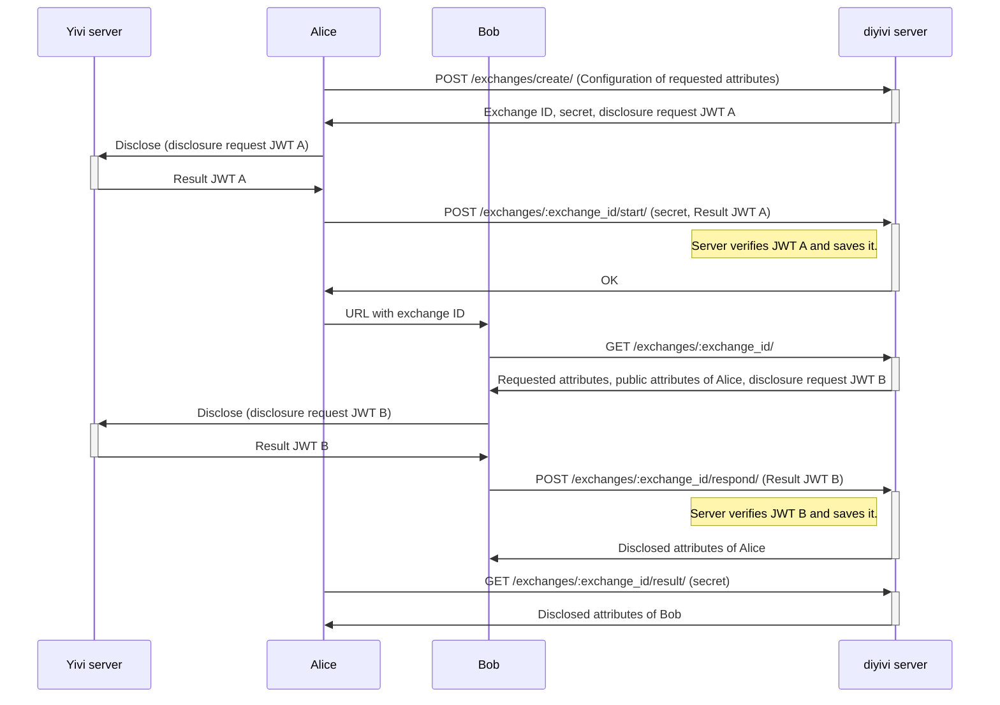

# Exchanges

Doing a Yivi disclosure between two users (as opposed to the traditional user-website disclosure) is the primary feature of DIYivi. We call this an 'exchange'. This document describes the reasoning behind the design of this feature.

## Background

The first goal of DIYivi is for users to be able to disclose Yivi attributes to each other in a privacy-friendly and easy way.

We assume that Alice and Bob are the participants in the exchange, and they have set up a (trusted) channel between them (e.g. through a messaging app or email).
For usability, we require that an exchange requires only a single, one-way communication from Alice to Bob over this channel. Additionally, we require that both participants have to do only a single Yivi session.

### Driver's license pilot

In the past, some [research](https://openresearch.amsterdam/nl/page/104367/rijvaardigheid-aantonen-via-irma-op-je-mobiel-peer-to-peer)
has been into the usability of a system where law enforcement officers
can perform peer-to-peer exchanges of a driver's license credential. There, a frontend to request
such attributes would be included in the Yivi app, where a police officer would show a QR code to
a civilian, which, when scanned from the Yivi app, would:

- Present the officer's badge number (and optionally other contact information) to the civilian.
- Request the attributes of the civilian, such as name, date of birth, and driver's license type and date,
  as configured by the officer.
- Indicate that the officer is legally allowed to request these attributes.

This system was only a frontend prototype, and has not actually been implemented. It would
require at least a backend IRMA server, and significant functionality in the Yivi app.

This concept has clear similarities with the exchanges offered by DIYivi, and has been
a source of inspiration for the (UI) design of the exchanges feature. A notable difference is
that the prototype was built into the Yivi app, while DIYivi is a separate web application.
For DIYivi, it does not seem reasonable to require significant changes to the Yivi app itself.

A very nice feature of this prototype is that there is a form of Relying Party authorization:
the citizen sees who the poice officer is, and that they are legally allowed to ask for information.

### European Union Digital Identity Wallet

The European Union is working on a framework for Digital Identity Wallets (EUDI Wallets),
very similar to and inspired by Yivi.
These EUDI Wallets will support offline, proximity-based disclosure of certain credentials.
This means that they could support peer-to-peer disclosure of attributes without involving a third-party server.
That can be a privacy-friendly way to exchange attributes which is not possible in Yivi, because Yivi apps
can only communicate with a publicly reachable server that gets to see the attributes that are disclosed.

## Protocol

The protocal that we have decided to implement in DIYivi is as follows:

Here, the DIYivi backend needs to be fully trusted: it can see all data, and could cheat.
This is not ideal, but is a trade-off based on the following considerations:

1. It would be nice for privacy and security if there's no server that sees personal data.
2. However, Yivi requires there to be at least an `irma server` that sees the attributes,
   so, practically speaking, there is always a server that sees the attributes. Whether that
   is only a normal `irma server` (hosted by DIYivi) or also an additional DIYivi backend makes
   little difference.
3. A nice way to ensure fairness between the two involved parties is to require a 'symmetrical'
   exchange, where both parties disclose the same attributes. To enforce this, a third party is
   needed that verifies that _both_ parties have disclosed attributes, before showing these attributes
   to the other party.
4. To verify a Yivi disclosure, the `irma server` originally used for the disclosure needs to be trusted.
   This server not only gets to see the attributes (consideration 2), but it can also cheat.
   Yivi currently does not support a way to independently verify a disclosure after the fact.

By opting for an approach that trusts the DIYivi backend server, we get significant usability benefits,
a simple protocol and code (no need to do intricate cryptographic tricks to communicate through a
server without it being able to read data or cheat), and it becomes straightforward to implement
features like 'escrow' (gelijk oversteken) of the attributes, so that no user can cheat to get data
from another user without also disclosing their own data.

## Protecting agains man-in-the-middle attacks

The protocol as described above is vulnerable to a kind of man-in-the-middle attack.
Consider a case where Alice initiates an exchange, and sends the link to Eve.
Then, without responding to the exchange, Eve sends the link to Charlie.
Charlie could be convinced that the link was sent by Alice (it was actually Eve) and
Alice could be convinced that the person she sent it to (Eve) is Charlie.

With the initial requirement of sending only a single message over the channel between the two parties,
there is not much we can do about this (there's no good way to do e.g. a key exchange).
Instead, we can mitigate this vulnerability with a more practical trick:

- The initiator (Alice) is asked to disclose an attribute that the recipient (e.g. Charlie) can check
  against whatever channel the link was sent over. For example, if the two communicate over e-mail,
  Alice would disclose her e-mail address. When Charlie receives the link, they're asked to check that
  it was indeed sent from Alice's address. The same can be done with a phone number if the two
  communicate over SMS, WhatsApp, Signal, etc.

By explicitly requiring the initiator to disclose such an attribute, and prompting the recipient very
clearly to check it, we can protect against this attack pretty well, without hurting usability too much.

An additional mitigation is also possible, but would have more impact on usability, so it is not applied:

- Alice could **additionally** be asked to specify the expected vale of an attribute for a recipient.
  For example, Alice indicates that the exchange can only be answered by someone with a specific
  e-mail address (charlie@example.com).

  However, this is only an additional measure: it does not by itself prevent replay where *Charlie* is the victim.

  It also hurts usability because it's an additional step for Alice (who also needs to get it precisely right),
  and it does not work well in the potential future feature of a _1-to-many_ or _many-to-many_ exchange,
  where Alice makes a single exchange link that she can send to many people to either perform individual
  exchanges with each of those, or a single exchange with the group (where they all get to see multiple
  people's responses).
