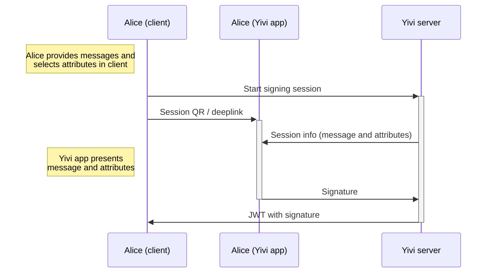
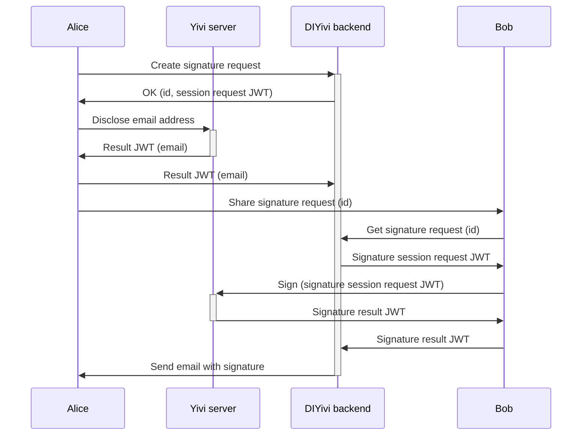
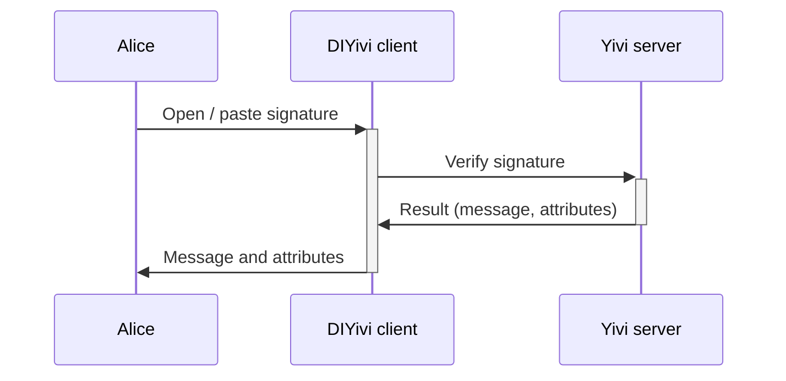

# Signatures

DIYivi offers a front-end to use Yivi's attribute-based signatures. Users can:

- Create a signature.
- Verify a signature.
- Request a signature from someone else.

## Background

While attribute-based signatures have been available in Yivi for quite some time, as far as I know,
they have not been used much. This likely has several reasons:

- Currently, signatures can only be made on a plain-text string. Technically, it's easy to enable
  signing of files (such as PDFs), but this has not been implemented in Yivi (especially in the
  Yivi app). As a result, for many applications, the only reasonable alternatives are:

  - Signing a hash of the file (which is not user-friendly and hence not really secure).
  - Relying on a third party that makes a classical signature on the file,
    after a _disclosure_ from the user to that party. Here, the user is not in control
    of the creation of the signature, which similarly limits the trustworthiness of the signature.

- Creating a Yivi signature (currently) requires that the message to be signed is sent to an
  `irma server`, that can theoretically spy on the message, or even try to trick the user into
  signing a different message.

- There is no publicly accessible example of how Yivi signatures can be used. At the time of
  writing, there is only an outdated demo of requesting a signature on a hardcoded message,
  which does not present the actual signature to the user, and does not allow for verification.

- There is/was no API endpoint for signature verification in `irma server`.
  For DIYivi, I have implemented this, and this may (have) be(en) merged into `irmago` some day. See https://github.com/privacybydesign/irmago/pull/391.

## Features

This is the functionality provided by DIYivi:

1. The user can create a signature on a plain-text message, using attributes selected by the user.
2. A user (Alice) can create a request for someone else (Bob) to sign a message, with message and attributes selected by Alice.
3. A user can verify a signature.

### 1. Create a signature

The user can create a signature on a plain-text message, using attributes selected by the user. The DIYivi client can do this communicating directly to the Yivi server.

Here, the Yivi server gets access to see the message, attributes, and signature.
The Yivi server could potentially try to trick the user into signing a different message.
The Yivi app will display the message that is being signed which partially protects against that.

### 2. Signature request

Alice chooses the message and the kinds of attributes. Alice creates the request on the DIYivi backend, and discloses her own email address to DIYivi. Then, Alice sends a link to Bob, who retrieves the message, attributes and a session request JWT from the DIYivi backend. Bob then signs the message, sends the signature result JWT to the DIYivi backend, which verifies the JWT and sends an email to Alice with the signature.

Here, both the DIYivi backend and the Yivi server can see the message, attributes and signature.
The signature will also be sent over email, which of course is not the most secure.
The Yivi server could potentially try to trick the user into signing a different message.
The Yivi app will display the message that is being signed which partially protects against that.

### 3. Verify a signature

The user can verify a signature. The DIYivi client can do this communicating directly to the Yivi server.
Signatures created with DIYivi are formatted as a link: `https://<diyivi domain>/signature/verify/#<signature data>`.
When that link is opened, it will open the DIYivi client, which immediately verifies the signature.
This makes for an intuitive user experience: a user who has received a signature can often simply click it to verify it.

Here, the Yivi server can see the message, attributes and signature.
The Yivi server could lie about the verification result, but anyone could verify the signature independently.
